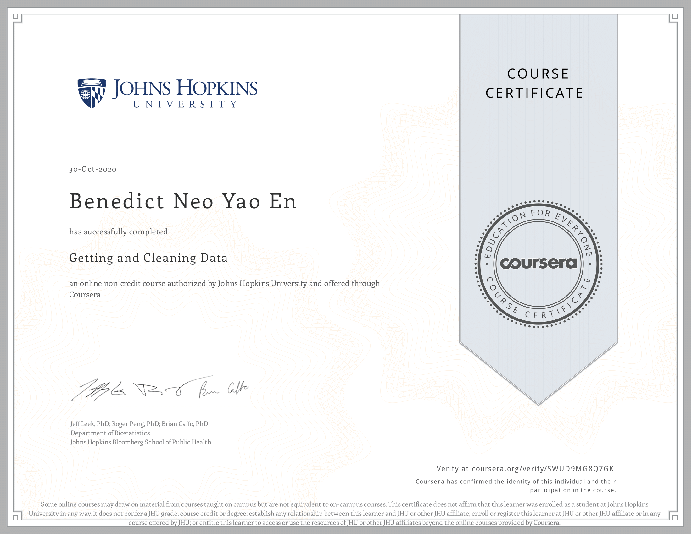

# Course Description
Before you can work with data you have to get some. This course will cover the basic ways that data can be obtained. The course will cover obtaining data from the web, from APIs, from databases and from colleagues in various formats. It will also cover the basics of data cleaning and how to make data “tidy”. Tidy data dramatically speed downstream data analysis tasks. The course will also cover the components of a complete data set including raw data, processing instructions, codebooks, and processed data. The course will cover the basics needed for collecting, cleaning, and sharing data.

## Articles 

Articles are coming!

## What I've learned
The first half of the course was all about reading in different kinds of data sources and understanding the data storage systems, which can be helpful when one deals with data in real-life. The second half was centered on cleaning data (Manipulating > Grouping and Chaning > Tidying with the dplyr package). The last week taught about using the lubridate package to work with dates and times and regex. The final assignment for this course was incredibly helpful to me, as it gave me an idea of what it's like to work with large data and clean it, albeit difficult and frustrating, it gave me valuable lessons.

## Tidy Data Paper
This course centers on the tidy data philosophy, which is a standard way of cleaning data and preparing it for analysis.
[Tidy Data - Hadley Wickham](https://vita.had.co.nz/papers/tidy-data.pdf)

## Proof of completion

 

[View it online](https://coursera.org/share/610fdef13b8e03a2884e0e4bad580d46)